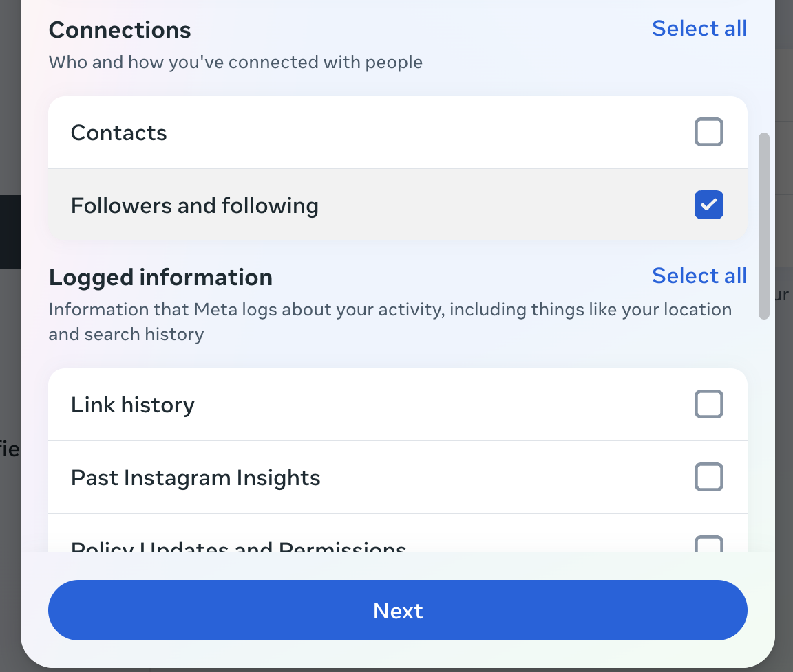
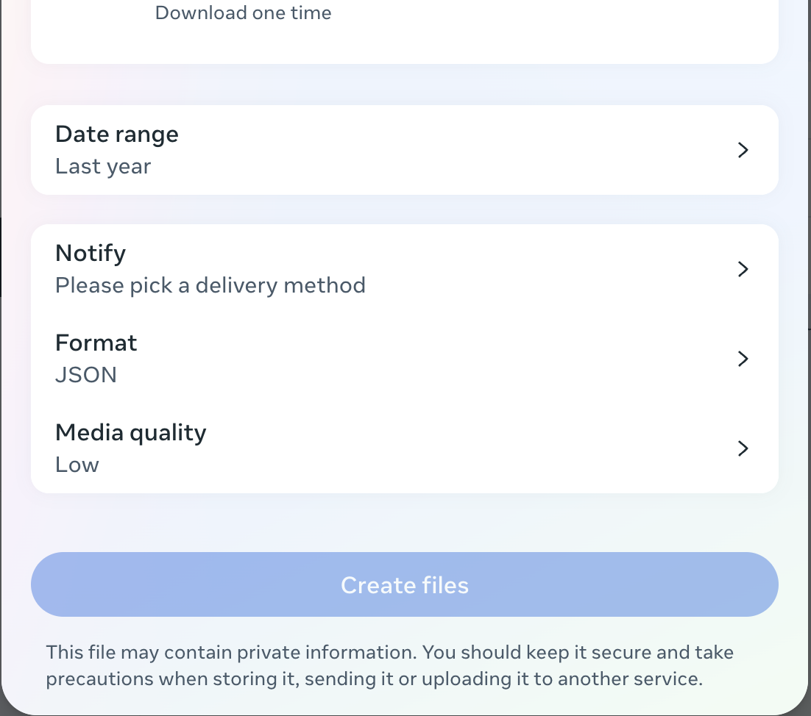
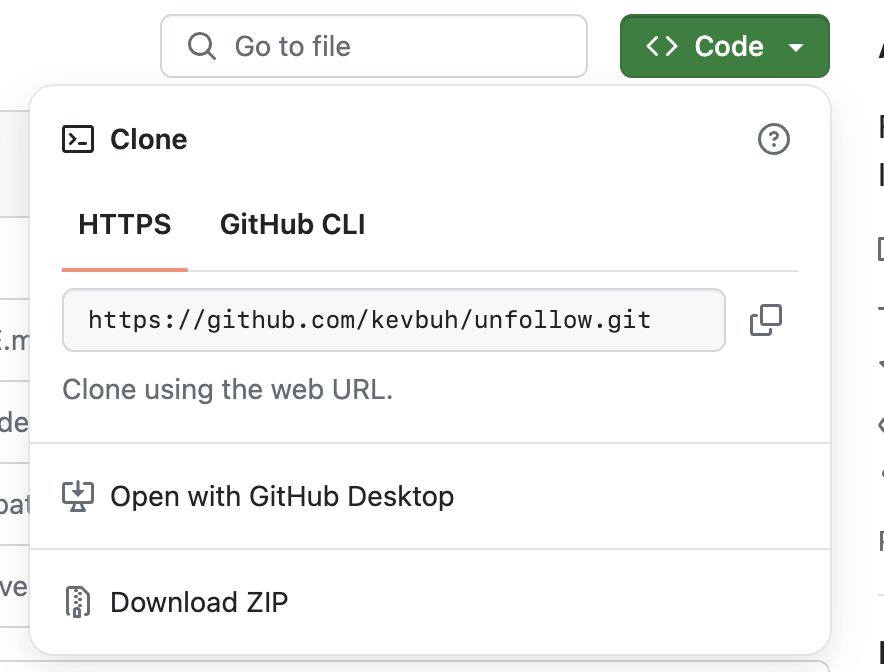
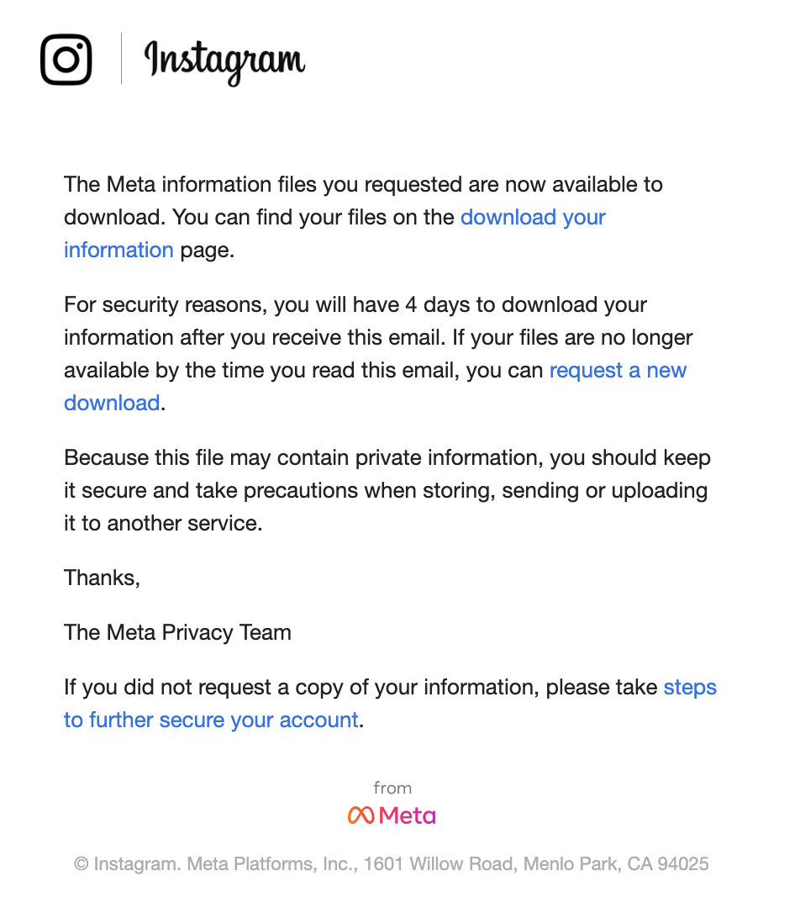

# Instagram Unfollow Tracker


This script allows you to see who has unfollowed you on Instagram by analyzing your followers and followings data.

## Part 1: Download Your Instagram Data

1. Go to your Instagram account → Settings → Settings and privacy
2. Click on the big Meta Accounts Center section
3. Navigate to Your information and permissions → Download your information
4. Select "Some of your information" → Check "Followers and following"

5. "Download to device"
6. Choose data range as 'all time'
7. Ensure "Format" is set to JSON (not HTML)
8. Instagram will send you an email with your account's data



## Part 2: Run the code

1. Download this Git repository as a ZIP file and unzip it
   

2. Once you receive the email from Instagram, download your information
   

3. Drag your downloaded ZIP file into the unzipped repository folder

5. Run the script:
   ```
   python3 unfollow.py
   ```

4. Input the name of your zip file (with .zip extension)

## Contributing

Contributions, issues, and feature requests are welcome. Feel free to check [issues page](https://github.com/kevbuh/unfollow/issues) if you want to contribute.

## Note

This tool is not affiliated with Instagram and does not violate Instagram's terms of service. However, it's important to note that using this tool may be against Instagram's automation rules, as it involves accessing Instagram's data in an automated way. We recommend using this tool sparingly to avoid any potential issues with Instagram.